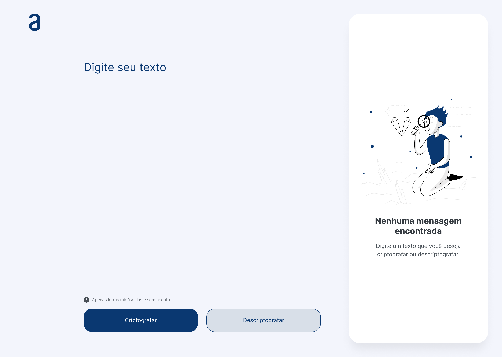

# Challenge-01-Oracle-ONE
# O que tem neste repositório?
Eu criei este repositório para armazenar o código do desafio do ínicio até a etapa final e claro, para que fique no meu perfil, assim fazendo parte do meu portfólio. 
# Me desafiaram a fazer o que?
A fazer um encriptador/desencriptador de textos. 
# Como isso deve ser feito?
[O texto abaixo foi copiado com leves modificações das instruções de como realizar o desafio.]  
As "chaves" de criptografia que pediram que eu utilizasse foram: 
A letra "e" é convertida para "enter" 
A letra "i" é convertida para "imes" 
A letra "a" é convertida para "ai" 
A letra "o" é convertida para "ober" 
A letra "u" é convertida para "ufat" 

Requisitos: 
- Deve funcionar apenas com letras minúsculas
- Não devem ser utilizados letras com acentos nem caracteres especiais 
- Deve ser possível converter uma palavra para a versão criptografada e também retornar uma palavra criptografada para a versão original. 

Por exemplo: 
"gato" => "gaitober" 
gaitober" => "gato" 

A página deve ter campos para inserção do texto a ser criptografado ou descriptografado, e a pessoa usuária deve poder escolher entre as duas opções 
O resultado deve ser exibido na tela. 
Extras: 
- Um botão que copie o texto  criptografado/descriptografado para a área de transferência - ou seja, que tenha a mesma funcionalidade do ctrl+C ou da opção "copiar" do menu dos aplicativos. 
# Qual é o resultado final proposto pelos criadores do desafio?

